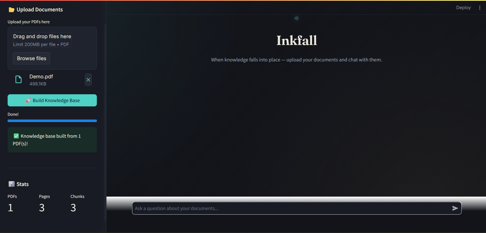
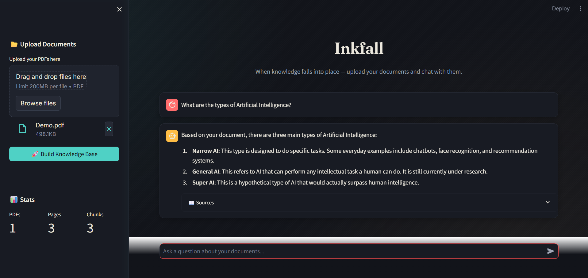
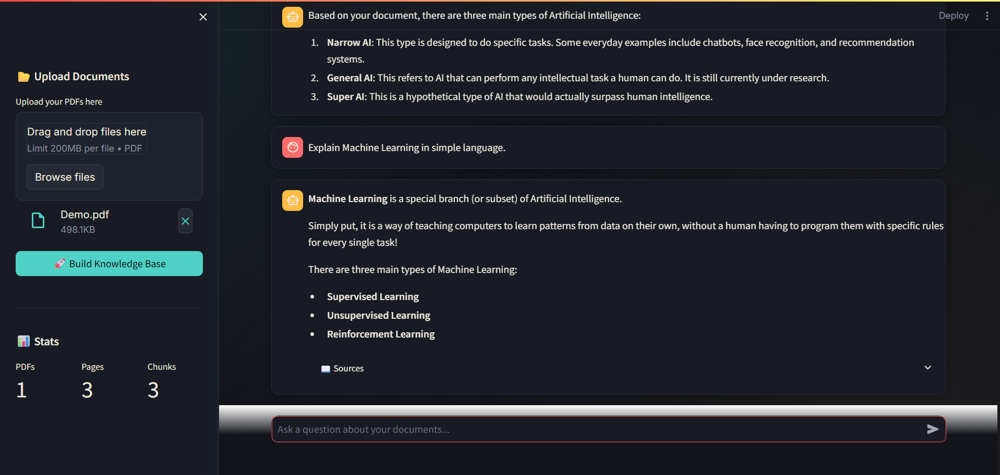
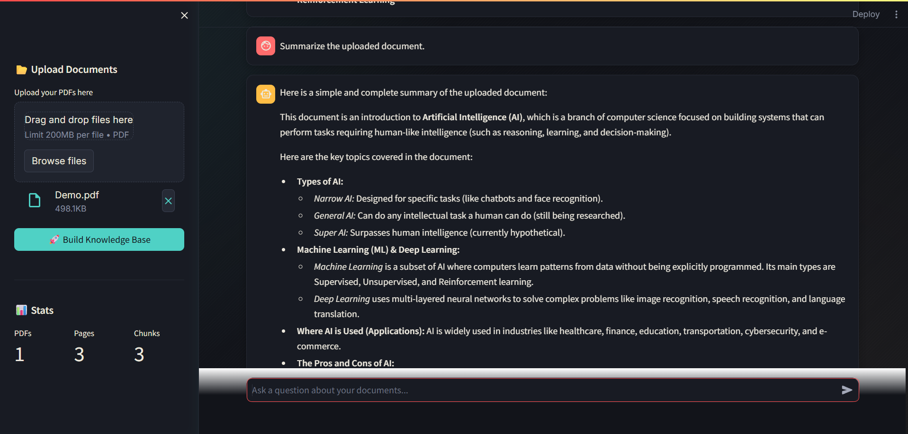

# 📚 InkFall

<div align="center">

### *When knowledge falls into place.*

An intelligent Retrieval-Augmented Generation (RAG) application that transforms static PDF documents into an interactive knowledge base using **Google Gemini**, **LangChain**, and **FAISS**.

Upload one or multiple PDFs, build a semantic knowledge base, and have natural conversations with your documents in seconds.

---


</div>

---

# ✨ Overview

Traditional document reading requires manually searching through hundreds of pages to locate information.

**InkFall** eliminates that process by converting uploaded PDFs into a searchable semantic knowledge base.

Instead of matching keywords, InkFall understands the **meaning** of your questions, retrieves the most relevant document chunks using vector similarity search, and generates context-aware responses using Google's Gemini model.

The result is a fast, accurate, and intuitive way to explore large documents.

---

# 🚀 Features

- 📄 Upload one or multiple PDF documents
- 🧠 Automatic Knowledge Base generation
- 🔍 Semantic Search powered by FAISS
- 🤖 Context-aware responses using Google Gemini
- 💬 Interactive conversational interface
- 📚 Source-aware answers
- 📝 AI-powered document summarization
- 📊 Live document statistics
- ⚡ Fast document processing
- 🎨 Modern dark-themed UI
- 📱 Clean and responsive layout

---

# 📸 Application Preview

## Home Screen

> Upload documents and build your personal knowledge base.



---

## Ask Questions

Retrieve context-aware answers directly from your uploaded documents.



---

## Explain Concepts

InkFall can simplify complex topics into easy-to-understand explanations.



---

## Generate Summaries

Summarize lengthy documents within seconds.



---

# 🏗️ How InkFall Works

```text
               Upload PDFs
                     │
                     ▼
         Text Extraction (PyPDF2)
                     │
                     ▼
     Recursive Text Chunking
                     │
                     ▼
     Google Embedding Generation
                     │
                     ▼
      FAISS Vector Database
                     │
                     ▼
 Semantic Similarity Retrieval
                     │
                     ▼
      Google Gemini Response
                     │
                     ▼
      Context-Aware Answer
```

---

# ⚙️ Technology Stack

| Category | Technology |
|-----------|------------|
| Language | Python |
| Framework | Streamlit |
| LLM | Google Gemini |
| AI Framework | LangChain |
| Vector Database | FAISS |
| PDF Processing | PyPDF2 |
| Environment | Python Dotenv |

---

# 📂 Project Structure

```bash
InkFall/
│
├── app.py
├── requirements.txt
├── README.md
├── .env.example
├── .gitignore
│
├── utils/
│   ├── chatbot.py
│   ├── pdf_reader.py
│   ├── prompts.py
│   ├── text_processor.py
│   └── vector_store.py
│
├── static/
│   └── main.css
│
├── docs/
│   ├── home.png
│   ├── qa.png
│   ├── explain.png
│   └── summary.png
│
└── temp/
```

---

# ⚡ Installation

Clone the repository

```bash
git clone https://github.com/kgt-alpha/inkfall.git
```

Move into the project

```bash
cd inkfall
```

Create a virtual environment

```bash
python -m venv venv
```

Activate it

**Windows**

```bash
venv\Scripts\activate
```

**Linux / macOS**

```bash
source venv/bin/activate
```

Install dependencies

```bash
pip install -r requirements.txt
```

Create a `.env` file

```env
GOOGLE_API_KEY=YOUR_API_KEY
```

Run the application

```bash
streamlit run app.py
```

---

# 💡 Example Questions

```
What are the main topics discussed?

Summarize this document.

Explain this topic in simple language.

Compare the concepts mentioned in the PDF.

List all important points.

Give me a beginner-friendly explanation.

Which page talks about Machine Learning?

What are the key takeaways?
```

---

# 🎯 Why InkFall?

Unlike traditional keyword search, InkFall understands the **context** behind your question.

By combining Retrieval-Augmented Generation (RAG) with semantic vector search, it retrieves only the most relevant information before generating a response.

This approach significantly improves answer quality while reducing hallucinations and making document exploration faster and more intuitive.

---

# 👨‍💻 Author

**Shivam Mishra**

Computer Science Undergraduate passionate about Backend Development, AI Applications, and Building Practical Software.

If you found this project useful, consider giving it a ⭐.